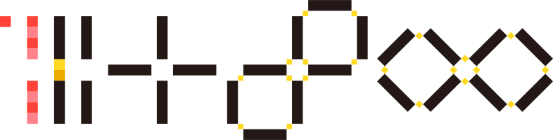
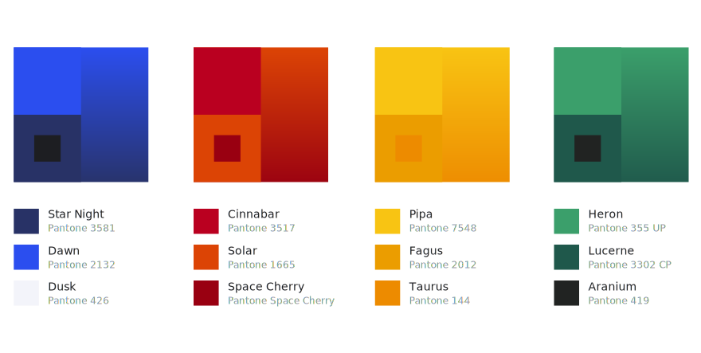
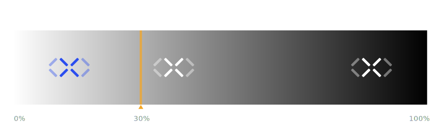

# 乘法云品牌 

#### 品牌标志图形 Brand Symbol

---

#### 品牌标志中文 Brand Type In Chinese

---

#### 品牌标志西文 Brand Type In Western Language

---

## 品牌标志

#### 品牌标志的绘制

在某些特殊使用场景中，需要用简单的制图手段和方法重新绘制乘法云的品牌标志时，请按照以下标注的绘制方法进行绘制：

#### 品牌标志的特殊处理

乘法云的品牌标志图案使用了两种颜色，只需在使用的时候，将不同区域的图形做透明度处理即可：

---

## 品牌标志意义

乘法云是一家产品技术驱动的公司，我们有自己的 PaaS 平台，以及基于平台的 SaaS 和定制化服务，我们的愿景是打造商业操作系统，让企业软件的开发、应用更加高效。

#### 共享智慧

乘法云是一帮对业务、技术、产品设计有极高造诣的极客们智慧的结晶。

#### 不变应万变
从企业级系统的本质出发，通过排列组合产出满足一切业务需求的软件工程哲学。

#### 好、快、省
Triones 平台的愿景是让企业级系统的开发就像搭乐高积木一样简单让客户卸下产品、技术的专业包袱、专注于业务。

乘法云的品牌标志符号有多重含义，这些含义覆盖了乘法云的产品思维、商业逻辑及品牌文化基础依据。

以上的符号和象征都是「乘法云」品牌*从现在到未来所可能发生的一种理念的描摹。*充分的了解象征的意义，是充分实践理念的踏实基础。

> * *代码/标签/技术*：指基础介质，代表着业务、逻辑、服务最本质的基础，也是发挥生产力最不可缺少的生产资料。
* *无限*：指信念与朝向：有了技术作为基奠，「乘法云」生产目的面向的是无限的可能性，也是「乘法云」核心理念——一生二、二生三、三生万物所朝向的终极目标。
* *裂变*：指产品、服务、品牌的行动方略及动力哲学，「乘法云」的核心服务目的就是为客户、领域、社会创造指数化的收益，这种动能的体现以裂变的现象为对照。
* *结构性/有机*：指产品、服务、品牌的建构哲学，有机体是一个系统，系统各个部分与整体之间有着紧密的关系，各个部分与整体都无法分割，一旦缺失了整体，部分也失去性质与作用。
* *Pattern/模式*：指产品、服务、品牌的设计哲学，呼应了「结构性/有机」的建构性，模式更加具象地体现了「乘法云」在生产过程中所运用和遵循的设计规则。
* *容器/容纳/分身/复制*：指产品、服务、品牌的运用哲学，也指代了系统特性及系统运用过程的灵活性，「乘法云」从前到后的运用体现就是以容器为典型模块，达到并体现「好、快、省」目的的运用哲学。
* *窗口/多样性/Vison*：指产品、服务、品牌的扩展哲学，窗口代表联系，多样性代表业态、服务对象的灵活性与丰富性，Vision 代表着发展的眼界。
* *疏而不漏/安全/把握*：指产品、服务、品牌的安全哲学，通过技术与管理的同步把控，为用户及对象提供强有力的支撑和保障。
* *安全/链条*：这里的安全与上一个意象呼应，链条则指产品、服务、品牌环环相扣的联系，同时也是指代着从前到后，从里到外链条式的处置模式及运行模式。

适当、合理地理解以上品牌标志意义，将有助于您在实际应用过程中产生更进一步的对于「乘法云」品牌的认识，从而增强对于工作目标的认知。

> 品牌标志，一方面体现了企业者本身的经历，映照了企业者个体或团体看待世界的思维方式和期待，也体现了企业者在扩展与生长自身的同时，每一阶段新生的细胞的共同信念，它即体现了每一个群体成员为达成共同追求而刻下的烙印，又炼铸了这个群体为了共同的荣誉而奋斗、为了追求卓越而努力实践的徽章。即是结果又是过程的集中体现，同时也是创造和生产所专注的目的之所至。

## 品牌基本结构

对基本结构的理解有助于您更轻松的掌握品牌标志的基本几何规则。为了与 Triones 呼应，可以注意到 Logo 节点的数量同样为7个：

下图标注了「乘法云」品牌标志的空间结构：

## 品牌彩色标志

按照图示及规范要求正确地使用企业品牌标志,将提升企业的品牌辨识度，为企业的价值传递做好稳固的基础。下图所展示的是「乘法云」的标准彩色完整标志样式造型。

## 品牌黑色标志

标志黑色制图,指在特殊条件下,工艺不能满足使用常规彩色标志图案的情况下并且背景为浅色时使用；

<em class="s">注意，标志中的浅色部分为主体色的 40% 亮度/透明度</em>

## 品牌反色标志

标志反色制图,指在特殊条件下,工艺不能满足使用常规彩色标志图案的情况下并且背景为深色时使用。<em class="s">注意，标志中的浅色部分为主体色的 40% 亮度/透明度，在使用本颜色时，请根据使用场景谨慎设置。</em>

## 标志最小尺寸限定

标志图案在使用过程中，为了避免无法识别的情况，都会限定最小使用尺寸。根据各种不同应用场景，本例提供了不同应用场景的参考。请严格按照规定使用。 

## 标志空间

所有非单独使用标志图案的场景，都需要统一使用整套标志制图。

标志图案、标志中文字体与标志英文字体统一称为「标准标志制图」，在整套「标准标志制图」使用过程中，须严格按照图中给出的比例关系使用；请严格按照规范酌情使用；`注意：「乘法云」的品牌标志没有上下排列的方式。`

> 我们强烈建议尽量在使用品牌标志过程中，不使用中英文混合的排列方式。

## 色彩

乘法云品牌色彩是表现「乘法云」品牌视觉的基础要素，它帮助我们创建统一、连贯的品牌体验和产品体验，在使用品牌色彩时请注意`使用固定的颜色，务必不要变更亮度、饱和度、色相、透明度`，下面是「乘法云」的品牌主要用色(Primary)和辅助用色(Secondary)：

了解更多的品牌色彩使用规则，请点击[色彩](color)

## 字体

使用「乘法云设计系统」的规范字体，其作用首先是为了统一整体品牌视觉传达的一致性，为用户及客户带来可信任的、专业的感受；其次，更重要的是避免在知识产权不断完善的今天，因不当使用字体厂商的商用字体产生的知识产权法务纠纷，为了这个目标，请`务必不要随意使用字体、请按照本系统规范合理使用字体。`

了解更多的品牌字体使用规则，请点击[字体](typography)

## 特殊工艺

当印制在金属表面，或是其他特殊材质时，使用本规范中的定义，将有效的保证品牌的一致性。

#### 凹凸

标志在制作在金属以及其他特殊材料上时，使用不同的刻制深度或高度，以达成表现的最佳效果。

如果制作工艺无法满足要求，那么可以使用其他手段，例如在需要工艺的细节使用不同的纹理进行处理：

#### 特殊工艺金属色彩

下方罗列了特殊工艺的推荐色彩，在使用特殊工艺时，如果条件允许，那么请使用下方的特殊金属色彩。

因为其余特殊材质比较繁杂，请酌情使用工艺与色彩，注意，如条件允许的情况，务必有限使用「乘法云」品牌色彩，了解更多的品牌色彩使用规则，请点击[色彩](color)

## 应用

这里罗列了「乘法云」标志在不同设备应用场景中的应用案例、绘制的基本规则，相关资源下载请点击[资源](resource)。

#### 基本框架

为了让品牌标志在设备屏幕上有良好的表现，请使用图示中的框架来设计应用图标。首先在一个方框空间内放置半径等于该方框的圆形，然后在圆形内放置内切菱形，将标志的边缘对应到该内切菱形的边即可。

#### iOS
iOS 系统中的应用图标效果及设计规则，请注意，如果需要修改或重新生成例如 iTunes Artwork Icon，请使用 2048*2048 的规格进行修改-导出-生成：

#### Android

Android 系统中使用轻圆角样式的图标，请注意，圆角的半径为图标边长的 1/16，比如图标边长512，那么圆角半径为 32 即可。

#### 其他

在一些特殊系统或是应用中，可以使用圆形的构成方式：

所有的图标资源请到 [资源](resource) 中下载。

## 品牌组合标志

当与合作厂商进行联名或合作市时，使用一下的排列形式：

## 品牌子集标志

需要在品牌标志中标注：*课题/板块/部门划分*……等信息，请按照一下形式进行排列。

## 色阶

在任何使用场景中，当背景的暗度超出 *30%* 时，即使用反色标志图案的效果，若明度保持在 70% 或 70% 以上，则使用正常的品牌标志图案。

## 错误案例

正确的使用品牌标志是我们进行品牌传达的最基础要素，合理的使用品牌标志，避免使用错误，以加强品牌传达的一致性与专业性，为建立客户信任感提供了坚实基础，下面列举了使用过程中容易出现的常规错误：

