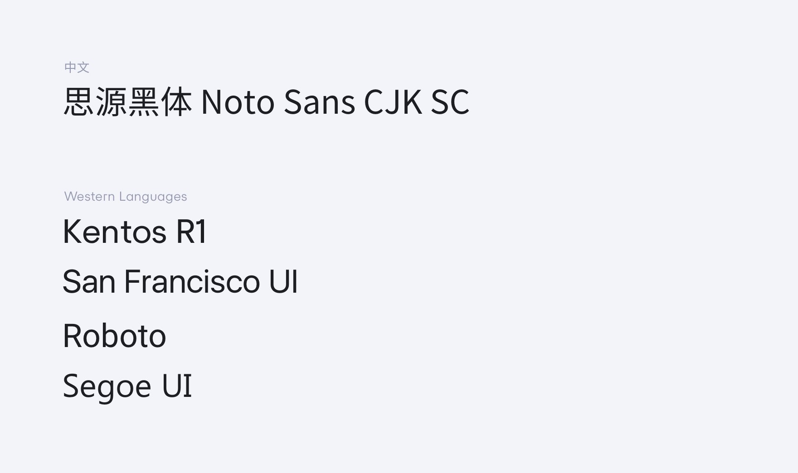
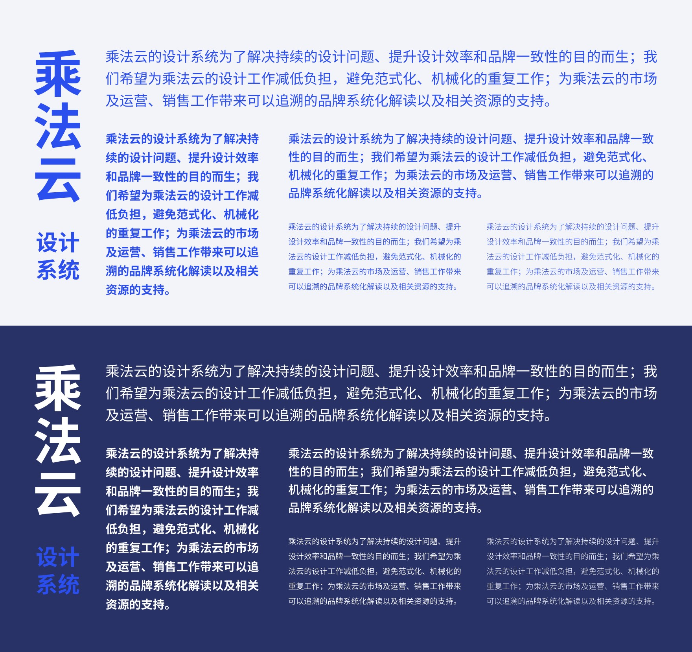
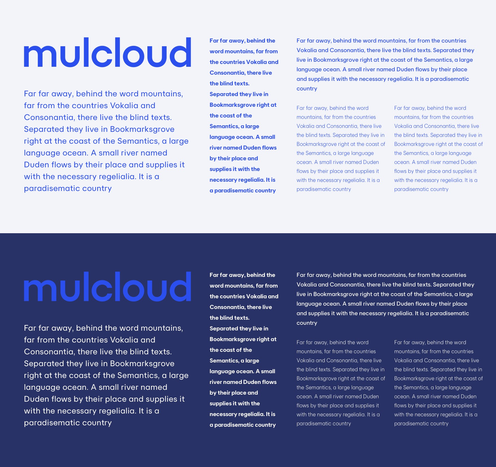

# 乘法云字体排印

使用「乘法云设计系统」的规范字体，其作用首先是为了统一整体品牌视觉传达的一致性，为用户及客户带来可信任的、专业的感受；其次，更重要的是避免在知识产权不断完善的今天，因不当使用字体厂商的商用字体产生的知识产权法务纠纷，为了这个目标，请`务必不要随意使用字体、请按照本系统规范合理使用字体。`

#### 乘法云所使用的字体清单



---

## 品牌字体

乘法云的品牌字体适用于所有品牌视觉相关的应用场景，使用合理的字体搭配，不但增强了品牌的整体视觉表现，也减少了误用字体造成的多余成本，品牌字体使用在以下场景：

> * *品牌视觉相关物料（如名片、导视系统、运营用图……）*
* *媒体出版物、第三方合作商宣发（网站、杂志、公众号报道、合作网站报道……）*
* *乘法云品牌官网、产品 UI、旗下产品官网及产品 UI 的标题字、甚至部分 UI 应用场景（不同系统的 UI 请参照[产品字体章节](#产品字体)）*
* *公司财报、合同、报表、演示文稿、发布会等标题字体。*


### 品牌中文字体

我们选择「乘法云」的品牌中文字体时考虑了以下的原则：
* 完全免费、自由、适用于商用场景的中文字体，以避免任何存在的法务纠纷的风险。（例如，甚至不使用苹果、微软等系统级提供商出品的系统自带字体，相关使用条款规定，系统使用的字体只可以在当前系统的环境下使用，若脱离系统使用环境，则是属于商业使用的范畴）
* 完全开放的 SIL 协议的字体（SIL 允许全方位的使用，并完全不存在类似 GPL 协议感染风险（GPL 协议要求使用方必须开源使用其字体的产品），SIL 协议不存在这个情况）。
* 完整的字符集，兼容屏幕及印刷品使用场景的中文字体。
* 没有大的设计缺陷、可以长久使用的中文字体。

经过谨慎考虑，我们选择使用 *思源黑体家族 - Noto Sans CJK (简体中文集合)*。 




### 品牌西文字体

我们选择「乘法云」的品牌西文字体时考虑了以下的原则：
* 原创或是适用于商用场景的西文字体，以避免任何存在的法务纠纷的风险。（例如，如果选择不符合 SIL 协议的西文字体，将会有潜在的法务风险，如在 Myfonts 或是其他字体销售平台购入字体，会受到 PageView 数量监控及限制（若使用于 Web），使用于印刷品及文档会受到用户数的限制。）
* 完整的西文字符集，极大兼容西欧、北欧等地区的使用。
* 设计风格亲切、大方、符合乘法云品牌格调的西文字体。



---

## 产品字体

乘法云的产品字体适用于所有产品视觉相关的应用场景，使用合理的字体搭配，不但增强了产品的整体视觉表现，也减少了误用字体造成的多余成本，产品字体使用在以下场景：

> * *所有屏幕设备的基本 UI 字体*
* *媒体出版物、第三方合作商宣发的征文字体（网站、杂志、公众号报道、合作网站报道……）*
* *乘法云品牌官网、产品 UI、旗下产品官网及产品 UI 的正文字体*


> 以上的系统字体指定包含了中文默认字体的指定（例如，选择了 San Francisco 字体，系统会默认选择中文苹方字形。）

### CSS 字体指定

``` 
font-family:"Kentos R1" , -apple-system , BlinkMacSystemFont , Roboto , "Segoe UI" , "Helvetica Neue", "PingFang SC", "Noto Sans" , "Noto Sans CJK SC" , "Microsoft YaHei" , "微软雅黑" , sans-serif;
```

